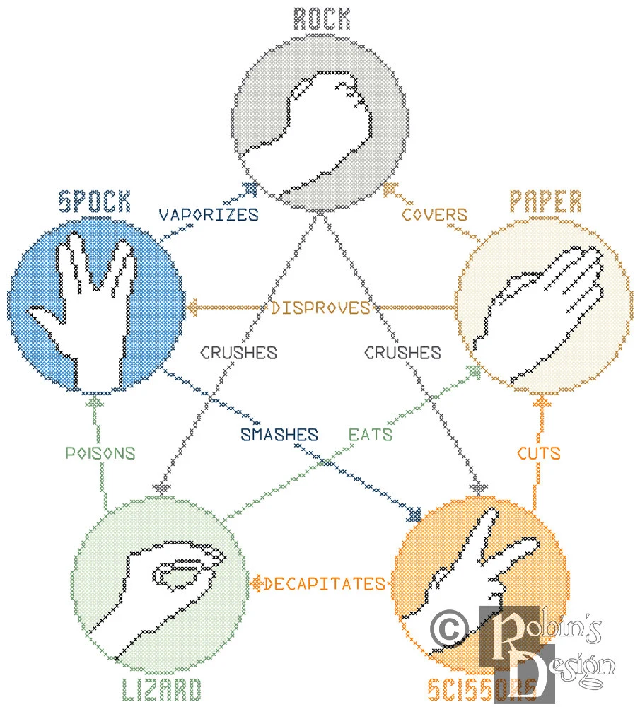

# Rock Paper Scissors Lizard Spock

This project was bootstrapped with [React](https://github.com/facebook/create-react-app).

The concept of this project was inspired by a [funny clip](https://www.youtube.com/watch?v=x5Q6-wMx-K8) of the famous sitcom "The Big Bang Theory" (Season 5, Episode 17), in which Sheldon explains the rules of the game because the traditional rock-paper-scissors has too high of a likelihood of producing a tie.

## [Site Demo (Github Pages)](https://rishiskhare.github.io/rock-paper-scissors)

The code is accessible in the folders above. The game is deployed on Github Pages and can be found at https://rishiskhare.github.io/rock-paper-scissors

### Rules Of Rock Paper Scissors Lizard Spock

