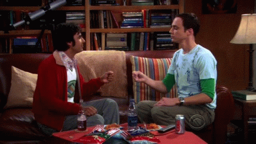

# Rock Paper Scissors Lizard Spock

This project was bootstrapped with [React](https://github.com/facebook/create-react-app). I implemented this project to get familiarized with React Forms and collecting user input.

The concept of this project was inspired by a [funny clip](https://www.youtube.com/watch?v=x5Q6-wMx-K8) of the famous sitcom "The Big Bang Theory" (Season 5, Episode 17), in which Sheldon explains the rules of the game because the traditional version of "rock-paper-scissors" has too high of a likelihood of producing a tie.

## [Site Demo (Github Pages)](https://rishiskhare.github.io/rock-paper-scissors)

The code is accessible in the folders above. The game is deployed on Github Pages and can be found at https://rishiskhare.github.io/rock-paper-scissors

### Rules Of Rock Paper Scissors Lizard Spock

![Rules Of Rock Paper Scissors Lizard Spock]
As Sheldon explains, "Scissors cuts paper, paper covers rock, rock crushes lizard, lizard poisons Spock, Spock smashes scissors, scissors decapitates lizard, lizard eats paper, paper disproves Spock, Spock vaporizes rock, and as it always has, rock crushes scissors."
